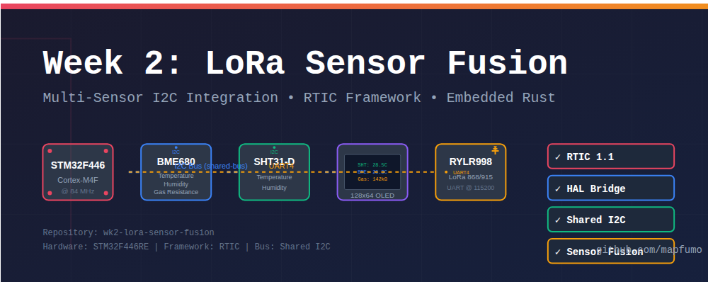

# Week 2: LoRa Sensor Fusion


STM32F446RE-based sensor fusion system that reads temperature/humidity data from multiple sensors and transmits via LoRa, with optimized OLED display output.

## Overview

This repository contains the firmware for **Node 1 (Remote Sensor Node)** of a 4-month embedded systems learning program. It is built using **Rust** and the **RTIC 1.1** framework for deterministic, interrupt-driven performance on the STM32F446RE.

This node acts as a "Data Producer," aggregating environmental telemetry and broadcasting it via LoRa (RYLR998) to a central gateway.

## Hardware Configuration

- **MCU**: STM32F446RET6 (Cortex-M4F @ 84 MHz, HSI clock)
- **Radio**: REYAX RYLR998 LoRa Module (UART4 @ 115200 baud)
- **Primary Sensor**: SHT31-D (Temperature & Humidity - Golden Reference)
- **Secondary Sensor**: BME680 (Gas Resistance, Temperature, Humidity, Pressure)
- **Display**: SSD1306 OLED 128x64 I2C
- **Power**: Split-rail (Elegoo MB102 for LoRa, Nucleo for Logic)
- **Debug**: LED on PA5

## Pin Configuration

| Peripheral | Protocol | Pin(s) | Function                          |
| ---------- | -------- | ------ | --------------------------------- |
| LED        | GPIO     | PA5    | Status indicator (toggles @ 1 Hz) |
| I2C1 SCL   | I2C      | PB8    | Sensor & Display bus clock        |
| I2C1 SDA   | I2C      | PB9    | Sensor & Display bus data         |
| UART4 TX   | UART     | PC10   | LoRa module transmit              |
| UART4 RX   | UART     | PC11   | LoRa module receive               |

## Key Features

- **Intelligent Sensor Fusion**: Each sensor used for its strength
  - SHT31: Primary for temperature (±0.3°C) and humidity (±2% RH)
  - BME680: Gas resistance measurement (VOC detection)
- **Shared I2C Bus**: Safe multi-device access using `shared-bus` crate
- **Optimized OLED Display**: Space-efficient 4-line layout with room for LoRa stats
- **LoRa Transmission**: AT command-based data transmission
- **RTIC Framework**: Interrupt-driven concurrency with compile-time guarantees
- **Real-time Updates**: 1 Hz sampling rate using hardware timer

## Building

```bash
cargo build --release
```

## Flashing

```bash
probe-rs run --chip STM32F446RETx target/thumbv7em-none-eabihf/release/wk2-lora-sensor-fusion
```

## Display Output

```
T:28.5C H:55%        (Line 1: Temperature & Humidity from SHT31)
Gas:142k             (Line 2: Gas resistance from BME680)
ID:01 RSSI:--        (Line 3: LoRa metadata - placeholder)
SNR:-- #---          (Line 4: Signal stats - placeholder)
```

**Display Layout**: Optimized 12-pixel line spacing with 4 lines of data, leaving 10 pixels free for future status indicators or 5th line.

## LoRa Protocol

Data is transmitted via UART to the LoRa module using AT commands:

```
AT+SEND=0,20,T:28.5H:55.2G:142\r\n
```

**Format**: `T:{temp}H:{humidity}G:{gas_resistance}`

Where:

- `T:` Temperature in °C (from SHT31)
- `H:` Relative humidity in % (from SHT31)
- `G:` Gas resistance in Ω (from BME680)

## Sensor Fusion Strategy

**Design Decision**: Use the best sensor for each measurement type:

| Measurement    | Sensor   | Accuracy | Rationale                                    |
| -------------- | -------- | -------- | -------------------------------------------- |
| Temperature    | SHT31    | ±0.3°C   | Dedicated high-precision sensor              |
| Humidity       | SHT31    | ±2% RH   | Superior to BME680 (±3% RH), no 48hr burn-in |
| Gas Resistance | BME680   | N/A      | Unique VOC detection capability              |
| Pressure       | BME680\* | ±1 hPa   | Not currently transmitted                    |

\*BME680 pressure and temperature readings available but not used in current implementation.

## System Architecture

### Framework

- **RTIC 1.1**: Real-Time Interrupt-driven Concurrency
- **HAL**: stm32f4xx-hal 0.23.0
- **Clock**: HSI @ 84 MHz (no external crystal required)

### Timers

- **TIM2**: 1 Hz interrupt for periodic sensor sampling
- **TIM3**: BME680 delay provider (1 MHz precision)
- **TIM5**: SHT31 delay provider (1 MHz precision)

### Resource Management

- **Shared Resources**: `lora_uart`, `display`, `sht31`, `bme680` (accessed via locks)
- **Local Resources**: `led`, `timer`, `bme_delay` (exclusive access)

## Dependencies

Key crates:

- `stm32f4xx-hal = "0.23.0"` - Hardware abstraction layer
- `cortex-m-rtic = "1.1"` - RTIC framework
- `sht3x = "0.1.1"` - SHT31 sensor driver
- `bme680 = "0.6.0"` - BME680 sensor driver
- `ssd1306 = "0.8.4"` - OLED display driver
- `shared-bus = "0.3.1"` - I2C bus sharing with mutex
- `embedded-graphics = "0.8.1"` - Graphics primitives for display
- `heapless = "0.8"` - Stack-allocated data structures
- `defmt-rtt = "0.4"` - Logging via RTT

See [Cargo.toml](Cargo.toml) for complete dependency list.

## Project Structure

```
wk2-lora-sensor-fusion/
├── src/
│   └── main.rs          # Main application code
├── Cargo.toml           # Dependencies and build config
├── memory.x             # Linker script for STM32F446
├── README.md            # This file
├── NOTES.md             # Learning notes and insights
└── TROUBLESHOOTING.md   # Issues and solutions
```

## Current Status

- [x] UART4 LoRa Bring-up
- [x] I2C Multi-sensor Bus Integration
- [x] OLED Display Integration
- [x] Sensor Data Fusion (SHT31 primary, BME680 gas only)
- [x] Temperature Conversion Fixes (centidegrees → °C)
- [x] Humidity Conversion (basis points → %)
- [x] Optimized Display Layout (5 lines, network info included)
- [x] Hybrid Transmission Mode (Button + Auto-timer)
- [x] Packet Counter Implementation
- [x] LoRa Transmission Verified (Logic Analyzer)
- [x] Runtime LoRa Module Configuration
- [x] Node 2 Receiver Implementation
- [x] LoRa End-to-End Communication (N1 → N2)
- [x] RSSI/SNR Signal Quality Monitoring
- [ ] Range Testing Documentation
- [ ] Binary Serialization (Week 3)

## Learning Resources

For detailed technical notes, see [NOTES.md](NOTES.md).

For troubleshooting and common issues, see [TROUBLESHOOTING.md](TROUBLESHOOTING.md).

## License

This project is part of a 4-month embedded systems learning program.

---

_Author: Antony (Tony) Mapfumo_
_Part of the 4-Month Embedded Rust Learning Roadmap_
